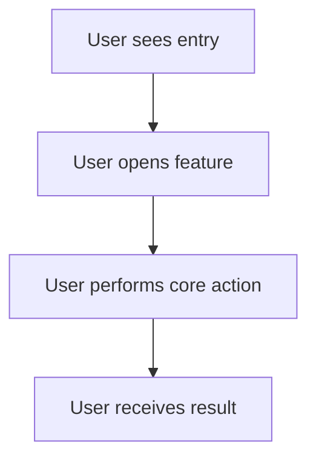
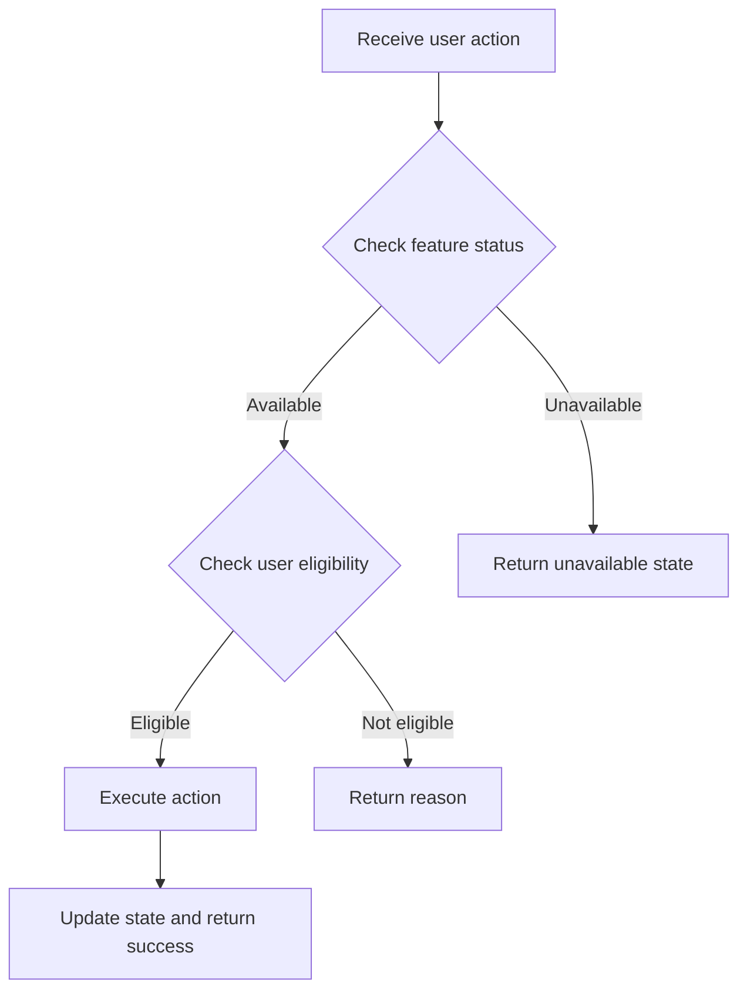

# PRD Flow Modeler

## Purpose

Translate rule logic into flows that show how users, systems, and states move through the feature.

## Inputs

- Rule model.
- Scope boundary.
- Known entry points and target pages, if available.

## Process

1. Identify entry points.
2. Write the happy path.
3. Write system judgment flow behind the happy path.
4. Write exception paths.
5. Write state transitions.
6. Identify where user-facing feedback is required.
7. Identify where system logging or operations visibility may be needed, but do not define full analytics here.

## Flow rules

- Separate user behavior from system behavior.
- Include failure outcomes, not just success outcomes.
- Include empty, expired, permission-denied, duplicate, and network-failure states when relevant.
- Do not introduce new scope unless the rule model requires it.
- If the flow exposes missing rules, mark them as `Rule gap` and send them back to `prd-03-rule-modeler`.

## Output format

```markdown
# 03 Flow Model: {Feature Name}

## 1. Entry points
| Entry | User condition | Display condition | Destination |
|---|---|---|---|

## 2. User happy path


## 3. System judgment flow


## 4. State transition table
| Object | From state | Trigger | To state | Notes |
|---|---|---|---|---|

## 5. Exception flows
| Exception | Trigger | System behavior | User-facing response | Rule gap? |
|---|---|---|---|---|

## 6. Handoff to next stage
Recommended next skill: `prd-05-page-interaction`
```

## Definition of done

The flow model is complete when engineering and QA can see the feature path without relying on narrative interpretation.
